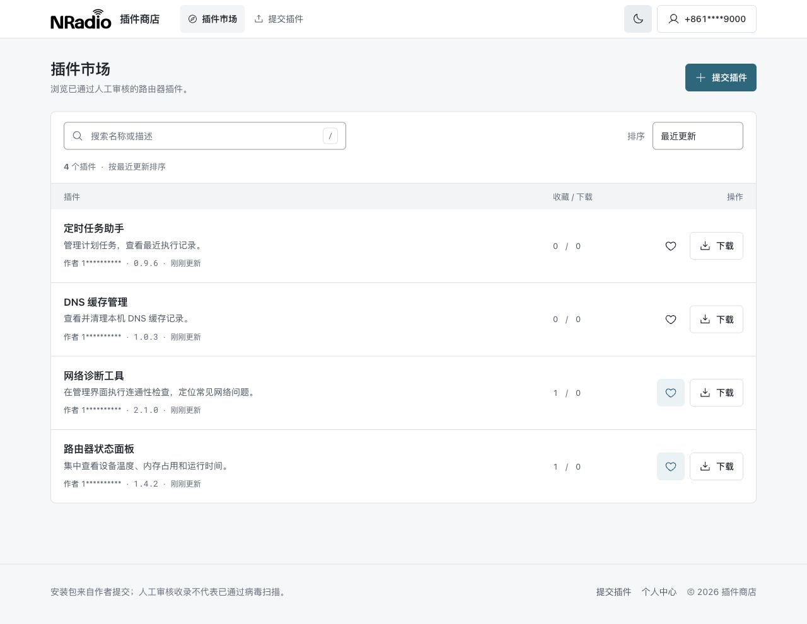
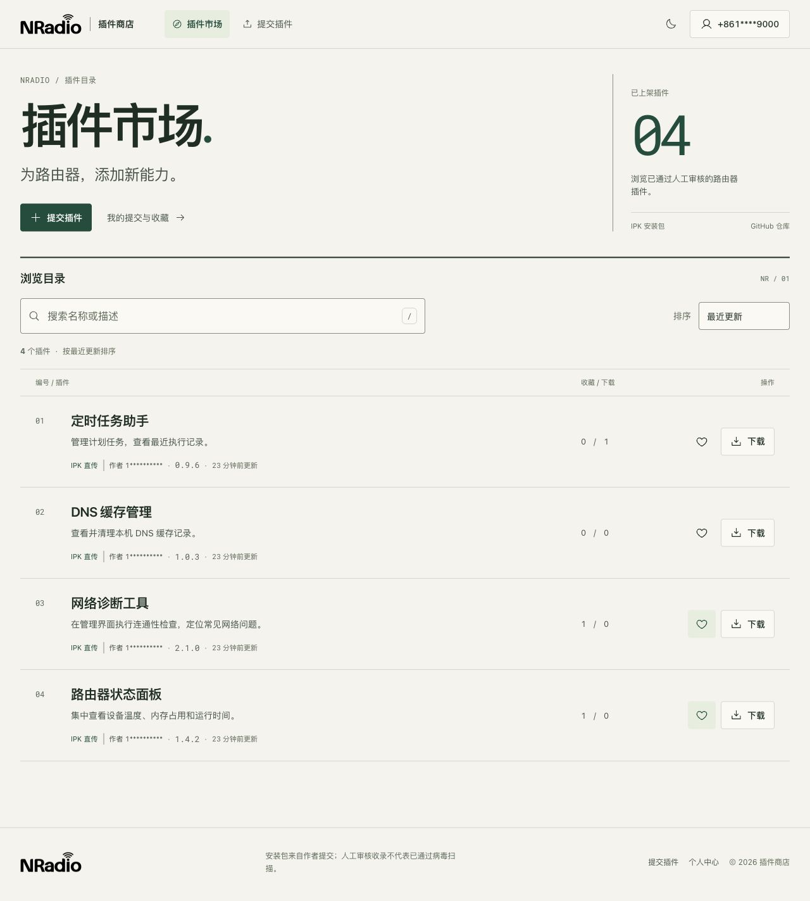
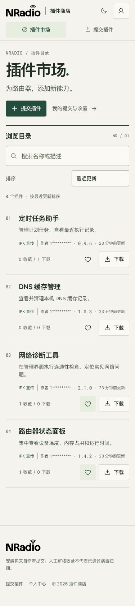
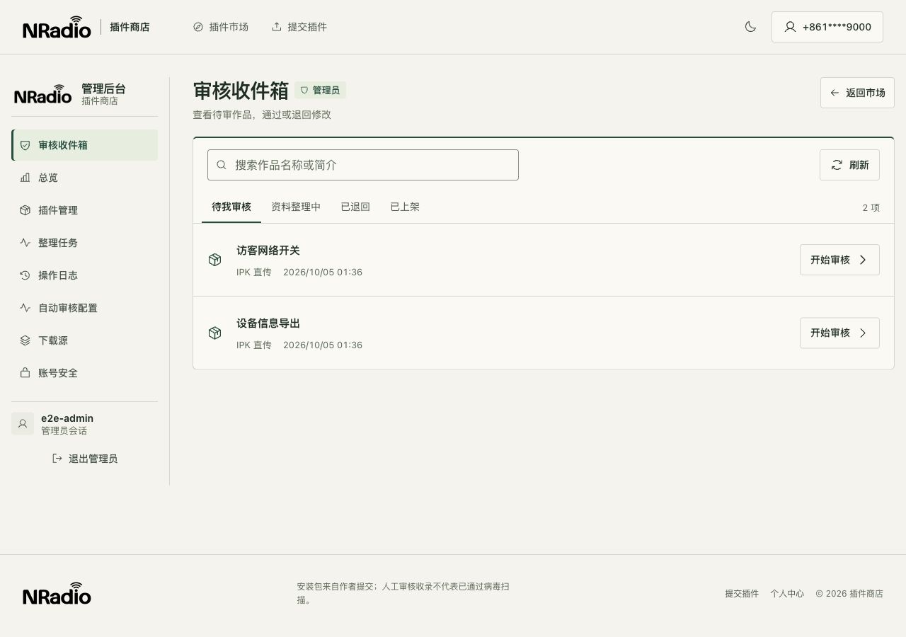
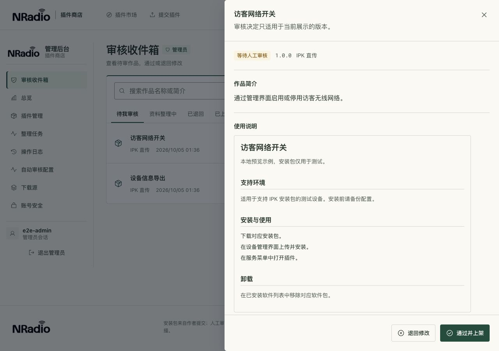
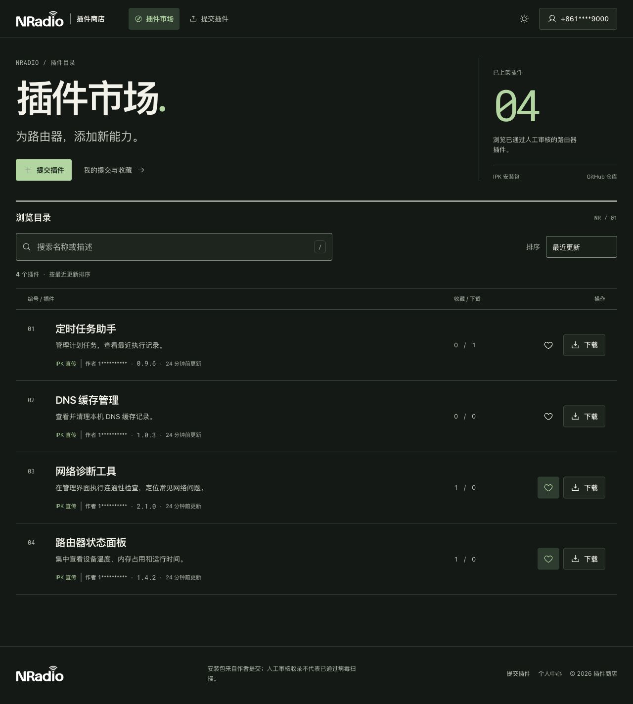

# 新版 UX：设计与验收记录

日期：2026-10-05。范围：插件商店现有 Vue 前端、本地预览与验证。未提交、推送、部署或执行远程迁移。

## 设计标准

用户要求以 Awwwards、Webby Awards、FWA 获奖作品的品质为目标。本次将它落实为视觉辨识、内容层级、真实任务完成、响应式、键盘操作、清晰反馈和技术质量的检查。内部检查不能代替外部评审；不自造奖项分数或宣称已经具备获奖资格。

| 参照 | 官方依据 | 在商店中的落实 |
| --- | --- | --- |
| Awwwards | [获奖作品页面展示的设计、可用性、创意、内容评分维度](https://www.awwwards.com/sites/peden-munk)；[Mobile Excellence 指南](https://www.awwwards.com/mobile-excellence-guidelines.pdf) | 品牌排版、触控、响应式、可读性；不给核心任务增加入场动画或滚动阻碍 |
| Webby Awards | [官方评审标准](https://www.webbyawards.com/judging-criteria/)包含内容、导航、视觉、功能、交互、创新与整体体验 | 搜索到详情、投稿到反馈、审核到决定的入口清楚；实际数据、标签与状态保持一致 |
| FWA | [官方 25 周年介绍](https://thefwa.com/FWA25/25.html)强调创意、原创与技术表现 | 以 NRadio 品牌和工业目录为主线；用同一套排版与交互语言贯穿各页，不捏造 FWA 评分权重 |

另阅读用户提供的 `awesome-design-md/design-md/` 中 Linear、Apple、BMW 分析。这些是第三方设计分析，不能当作品牌官方规则。

## 新方向

暖白纸面、墨色文字、深绿行动按钮和等宽目录编号构成公开市场的识别。标题、作品名称、说明与技术信息分层；桌面保留完整目录列，手机优先搜索与内容。后台保持紧凑，投稿以填写为中心，详情以阅读和选择安装包为中心。沿用用户提供的 NRadio Logo、现有路由、业务接口、统一账号体系与人工审核规则。

市场数量与编号来自当前结果及分页。来源标签来自作品记录；不编造推荐排名、分类、热度或统计。搜索高亮按字面量匹配，保留 Vue 文本转义。深浅主题共用语义令牌，保留已有主题选择。动效仅用于已有控件反馈，并保留减少动效支持。

## 检查与修正

| 轮次 | 发现 | 修正 |
| --- | --- | --- |
| 第一轮 | 原界面标题、表单和列表的字级接近，品牌层级弱；初稿手机标题区占用过多空间 | 建立工业目录风格；手机隐藏重复统计区并压缩首屏；统一投稿、个人中心、详情与后台的页面节奏 |
| 第二轮 | 浅色次要文字在两种交互表面上的对比度不足；搜索结果定位仍需阅读；收藏列表没有编号却占了编号空间 | 修正次要文字颜色；名称和简介显示匹配文字；将编号间距限定到目录行；市场搜索采用 16px 输入文字 |
| 第三轮 | 320px 下统计数字与文字分行；文档标题与作品标题争抢层级 | 收紧手机统计间距并保持数值标签完整；降低文档内标题字级；复核受影响页面 |

## 本地验收

- 现有功能测试：15 个测试文件、166 项通过；Vue/Worker 类型检查、静态检查及其他检查脚本通过。
- 首次完整检查在颜色对比度处失败，修正后重新执行颜色检查和生产构建；34 组配色对比度全部通过。最终前端类型、静态检查和构建通过，生产产物隔离检查通过。
- 市场、详情、投稿、个人中心、后台：浅色 320/375/768/1280/1440px，深色 375/1280px，共 35 个页面与视口组合。未出现页面横向溢出，Logo 正常加载；关键桌面、手机与深色截图已目视检查。
- 实际页面操作：搜索快捷键、真实搜索结果及匹配高亮、特殊字符空结果、清空后的输入焦点、排序刷新恢复、IPK 资料填写前后的选包限制、投稿标签键盘切换与草稿保留、个人收藏、收藏/取消、真实示例 IPK 下载、详情安装包/审核信息、审核抽屉 16 次 Tab 焦点限制、手机抽屉范围、Escape 关闭与焦点恢复、退回缺少原因时的提示和聚焦。
- 浏览器记录中未见错误。截图使用隔离的本地 D1/R2 和无害示例包；真实有赞授权、线上数据及部署性能不在本次验证范围内。

结构化结果见 [验证记录](evidence/ux-v2/verification.json)，颜色记录见 [对比度检查](evidence/contrast.json)。没有把 DOM 尺寸检查等同于完整的无障碍认证，也没有把本地构建等同于线上性能测试。

## 页面证据

原版市场：

新版市场：

手机市场：

新版后台与审核抽屉：

深色页面：

其他视口与投稿、详情、个人中心截图保存在同一证据目录。预览入口为 `http://127.0.0.1:8789/__preview/market`，后台为 `http://127.0.0.1:8789/__preview/studio`；这些入口仅在测试预览模式下存在。
